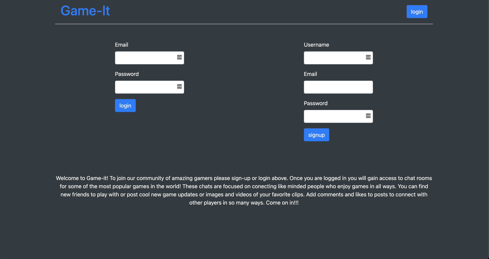

# Game-it

## Table of Contents

- [Description](#description)
- [Usage](#usage)
- [Installation](#installation)
- [Tech Used](#tech-used)
- [Licenses](#licenses)
- [Credits](#credits)

## Description

Game-it is a videogame blog app where users can signup for an account, login with their username and password, publish messages, comment on others' messages, and update or delete their own messages. This is a RESTful API app following MVC development using MySQL with Sequelize as an ORM and Handlebars for the front-end. Express was used for routing along with Sequelize for accessing the API data.

## Usage

Simply create a new account, or sign-in with a current account and start discussing your favorite games right away. Create a new message, or comment on a message already posted.

## Installation

- Both Node.js and MySQL must be installed on your computer.
- Clone the repo by copying and pasting in your command line:
  - `git@github.com:chris-pietrangeli/Game-It.git`
- Navigate to the root directory and run:
  - `npm install`
- To start the server, run the following in your command line:
  - `npm start`
- Navigate to `localhost:3001` in your browser to open the app locally.

## Tech Used

- JavaScript
- [Handlebars.js](https://handlebarsjs.com/)
- [Node.js](https://nodejs.org/en/)
- [Express.js](https://www.npmjs.com/package/express)
- [Express-session](https://www.npmjs.com/package/express-session)
- [MySQL](https://dev.mysql.com/doc/)
- [MySQL2](https://www.npmjs.com/package/mysql2)
- [Sequelize](https://www.npmjs.com/package/sequelize)
- [dotenv](https://www.npmjs.com/package/dotenv)
  ## Licenses
  This project is covered under the MIT license. To learn more about what this means, click the license button at the top.
  ## Questions
  Have questions about this project?  
  GitHub:
  - https://github.com/Jburg1414
  - https://github.com/codenamehemingway
  - https://github.com/chris-pietrangeli
    Email:
    - chris.pietrangeli11@gmail.com
    - jared.hemingway.jh@gmail.com
    - jburgess1414@gmail.com
  ## Credits
  Jace Burgess
  Chris Pietrangeli
  Jared Hemingway

  ## Deployed Link
  https://game-it1.herokuapp.com/

  ## Screenshots
  
  
  
